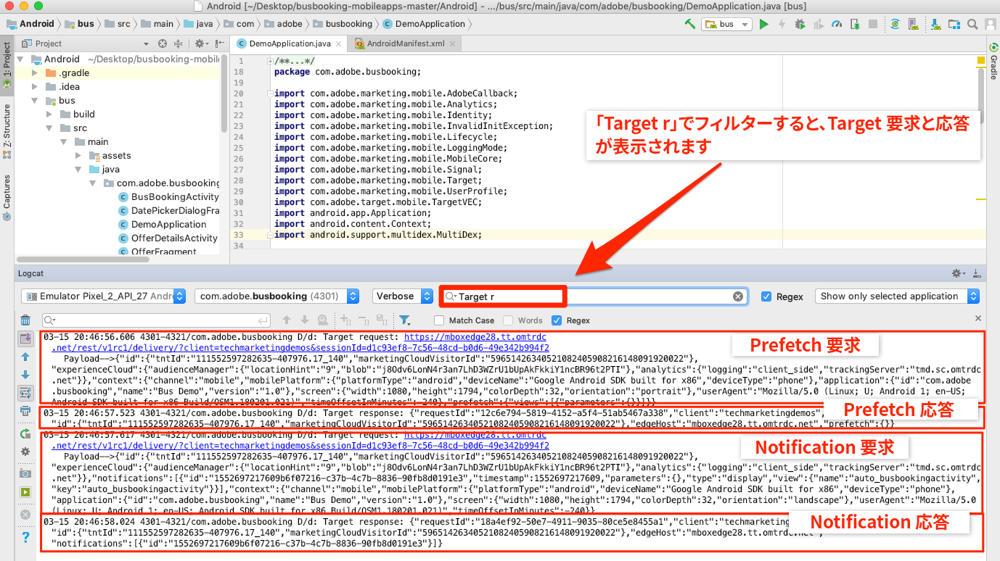
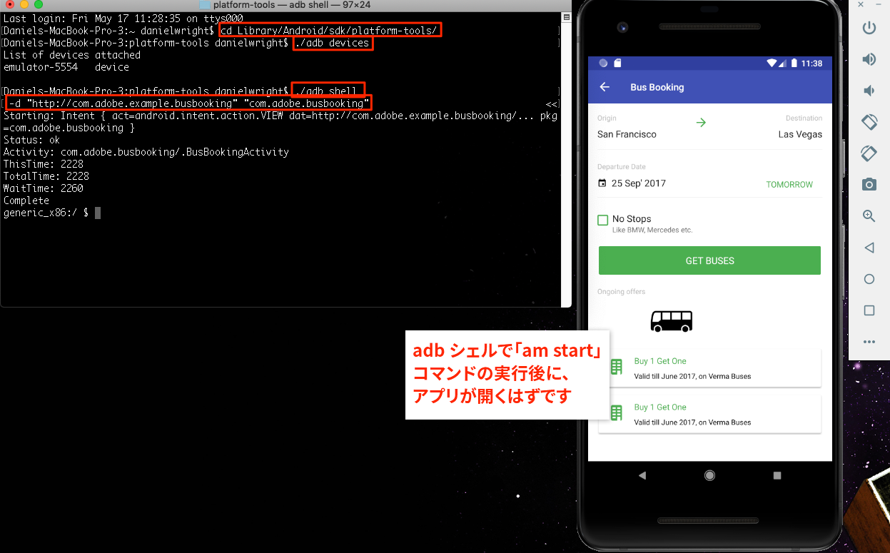
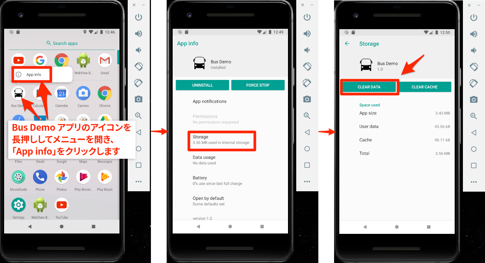
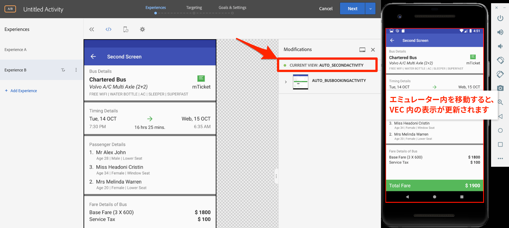

# Adobe targetのVisual Experience Composer(VEC)の追加

このレッスンでは、モバイルアプリに対してTarget Visual Experience Composer(VEC)を有効にします。

[Adobe targetは](https://docs.adobe.com/content/help/en/target/using/target-home.html) 、顧客のエクスペリエンスをカスタマイズしてパーソナライズするために必要なすべての機能を提供するAdobe Experience cloudソリューションです。Webやモバイルサイト、アプリ、ソーシャルメディア、その他のデジタルチャネルの売上を最大化できます。

ネイティブモバイルアプリ向け Visual Experience Composer（VEC）を使用すると、開発やリリースのサイクルに依存することなく、マーケターが自らアクティビティを作成したりコンテンツをパーソナライズすることができます。

「拡張機能の追 [加](launch-add-extensions.md)」のレッスンでは、「起動」プロパティにTarget VEC拡張機能を追加しました。 レッスン「Mobile SDKのイ [ンストール](launch-install-the-mobile-sdk.md) 」では、サンプルアプリケーションに拡張機能を読み込みました。 TargetのMobile Visual Experience Composerでアクティビティの設定を開始するには、若干のマイナーアップデートのみが必要です。

>[!IMPORTANT] モバイルアプリケーションでTarget VECを使用するには、TargetとTarget VEC起動の両方の拡張が必要です。

## 学習目標

このレッスンを最後まで学習すると、以下の内容を習得できます。

* Target VEC用のサンプルアプリを有効にする
* Target VECリクエストへのパラメーターの追加
* デバイスとVECのペアリング
* VECを使用したアクティビティの作成

## 前提条件

この節のレッスンを完了するには、次の作業を行う必要があります。

* 「起動の設定」セクションの [レッスンを完了](launch-create-a-property.md) します。
* Adobe targetインターフェイスへの承認者レベルのアクセス権を持つ

## アプリの読み込みリクエスト

Targetは、Target VEC拡張の設定時に選択した設定により、アプリが最初に読み込まれる際に「アプリの読み込み」リクエストを実行します。 このリクエストは、アプリ用に作成したすべてのTarget VECアクティビティを事前取得します。

Android studioで、Logcatを「Target r」にフィルターして、Targetのリクエストと応答を表示します。 アプリケーション名とバージョンのパラメーターに注意してください。 作成するすべてのTarget VECアクティビティは、自動的にこれらのプロパティをターゲットにします。



## パラメータの追加

前の練習で見たように、アプリのライフサイクル指標はTarget VECリクエストのパラメーターとして自動的に含まれます。 また、リクエストに対して、グローバルに、またはアプリ内の特定のビューに対して、カスタムパラメーターを追加することもできます。

**カスタムパラメーターをグローバルに追加するには**

1. Android studioで、ファイルを開 `DemoApplication` きます。
1. 既存のインポートの下にを追加して、Target VEC `import ACPTargetVEC` 拡張をインポートします
1. 拡張機能が登録される前に、関数に `onCreate()` 次のサンプルコードを追加します。 次のコード例は、標準パラメーター、プロファイルパラメーター、製品（またはエンティティ）パラメーター、注文パラメーターをTargetVECリクエストに追加する方法を示しています。 この例では静的な値を使用しますが、実際のアプリでは動的変数を使用して値を入力すると考えられます。 もちろん、すべてのビューに関連するパラメーターのみを設定する必要があります。

   ```java
   Map<String, String>targetParams = new HashMap<>(); //params
   targetParams.put( "param1", "value1");
   Map<String, String>taregtProfileParams = new HashMap<>(); //profile params
   taregtProfileParams.put("profilekey1","profilevalue1");
   
   TargetVEC.setGlobalRequestParameters(new TargetParameters.Builder()
            .parameters(targetParams)
            .profileParameters(taregtProfileParams)
            .product(new TargetProduct("1234", "furniture"))
            .order(new TargetOrder("12343", 123.45, Arrays.asList("100", "200")))
            .build());
   ```

1. 上記のパラメーターコードでは次のインポートが必要で、ファイルに追加する必要があるので、Android studioでエラーが発生する場合があります。

   ```java
   import com.adobe.marketing.mobile.TargetOrder;
   import com.adobe.marketing.mobile.TargetProduct;
   import com.adobe.marketing.mobile.TargetParameters;
   import java.util.Arrays;
   import java.util.Map;
   import java.util.HashMap;
   ```

   

アプリにパラメーターが追加されたので、リクエストでパラメーターが渡されていることを確認する時間です。

**パラメータを検証するには**

1. Android studioプロジェクトの保存
1. アプリを再構築し、エミュレーターで再び開くまで待ちます
1. Android studioのLogcatペインを開きます
1. 「Target r」を含むすべての文を表示するフィルター
1. 追加したカスタムパラメーターは、リクエストに表示される必要があります

   

特定のビューでパラメータを渡す方法の詳細および詳細については、ドキュメントを参 [照してください](https://docs.adobe.com/content/help/en/target/using/implement-target/mobile-apps/composer/mobile-visual-experience-composer-android.html#parameters)。

## モバイルアプリとTargetインターフェイスのペアリング

TargetインターフェイスでVECアクティビティを作成するには、まずTargetとアプリをペアにする必要があります。 このペアリングは、ディープリンクを使用して実現されます。

### ディープリンクの作成

Androidでは、ディープリンクと [Androidアプリリンクを使用して](https://developer.android.com/training/app-links/deep-linking) 、アプリ内の特定の場所に直接移動するURLを作成できます。 これらは既にアプリで使用している可能性があります。 その場合は、既存のURL構造を使用してTargetとペアリングできます。 このチュートリアルでは、バス予約アプリで事前に定義されたディープリンクを確認し、それが機能していることを確認してから、アプリをモバイルアプリ用のTarget VECとペアリングします。

**ディープリンクの設定を確認するには**

1. Android studioで、AndroidManifest.xmlファイルを開きます
1. バス予約アプリのディープリンクスキームに対して、既にインテントフィルタが設定されています
1. とは、それぞ `Host` れに `Scheme` 既にとが設定されて `com.adobe.example.busbooking` いることに注 `http`意してください。 つまり、エミュレーターで開いたと `http://com.adobe.example.busbooking` きのようなURLは、サンプルアプリケーションを自動的に開く必要があります

   

次の手順は、ディープリンクスキームが機能していることを確認することです。

### ディープリンクの確認

次に、ディープリンクがエミュレーターでアプリを開くことを確認します。 adbコマンドを実行する方法は、確実に使用できるので、お好みの方法で実行できます。

**adb(Mac®)を使用してディープリンクを検証するには**

1. Androidエミュレーターが実行されていることを確認します
1. 既にバス予約アプリが開いている場合は閉じる
1. ターミナルウィンドウを開く
1. Androidプラットフォームツールディレクトリに移動します。 `cd Library/Android/sdk/platform-tools/`
1. エミュレーターが接続されていることを確認します。 `./adb devices`
1. adbシェルを開きます。 `./adb shell`
1. adbシェルで、ディープリンクをテストします。 `am start -W -a android.intent.action.VIEW -d "http://com.adobe.example.busbooking" "com.adobe.busbooking"`
1. バス予約アプリがエミュレーターで起動したことを確認します

   

これで、ディープリンク構造が設定され、Target VECを使用してアクティビティを設定する準備が整いました。

## Mobile VECでのアクティビティの作成

次に、Targetインターフェイスでアクティビティを作成します。

**Target VECを使用してアクティビティを作成するには**

1. [Adobe Experience cloudへのログイン](https://experiencecloud.adobe.com)
1. ソリューション切り替えボタンを使用してTargetに移動

   

1. Targetの起動

   

1. 「アクティビティ **[!UICONTROL を作成]** 」ボタンをクリックし **[!UICONTROL 、「A/Bテスト」を選択します]**
1. モバイルア **[!UICONTROL プリを選択]**
1. 「Experience Composerを選択」で **[!UICONTROL 「]** Visual **[!UICONTROL 」が選択されていることを確認します。]**
1. 「 **[!UICONTROL Next]** 」ボタン

   

1. 使用するア **[!UICONTROL プリを選択画面で]** 、「新しいアプリを追 **[!UICONTROL 加」をクリックします]**

   

1. 「URLスキームを入力」フィールドに **[!UICONTROL 定義したURLスキーム]** (例： `http://com.adobe.example.busbooking/`
1. 「ディープリ **[!UICONTROL ンクを作成」をクリックします]**

   

   >[!NOTE] アプリにディープリンクを送信する方法はいくつかあります。 次のことができます。
   >
   >   1. 有効な電子メールアドレスにディープリンクを電子メールで送信し、デバイス上の電子メールアプリケーションでリンクを開きます
   >   1. AndroidデバイスからQRコードの写真を撮影します（このチュートリアルでは、デバイスをAndroid studioにリンクする必要があります）。
   >   1. Targetインターフェイスからディープリンクをコピーし、デバイスに送信します。


1. 「リンクをコピ **[!UICONTROL ーして送信]** 」タブをクリックします。
1. 生成されたURLをクリックします（URLをクリックすると、クリップボードに自動的にコピーされます）。

   

1. ターミナルウィンドウを開く（または、まだ開いている場合は戻る）
1. Androidプラットフォームツールディレクトリに移動します（既にここにある場合もあります）。 `cd Library/Android/sdk/platform-tools/`
1. エミュレーターが接続されていることを確認します。 `./adb devices`
1. adbシェルを開きます。 `./adb shell`
1. adbシェルで、次のコマンドの [YOUR_TARGET_URL_WITH_TOKEN] を、クリップボードにコピーしたURLに置き換えます。 `am start -W -a android.intent.action.VIEW -d "[YOUR_TARGET_URL_WITH_TOKEN]" "com.adobe.busbooking"`
1. アプリが読み込まれたら、Targetを開いたブラウザータブに戻ります。 アプリがVECに読み込まれていることを確認します。
1. アプリ内のテキストおよび画像アセットをクリックすると、編集および置き換えのオプションが表示されます。

   

   > [!TIP] モバイルデバイスでディープリンクを開いた後に、Mobile VECがTargetインターフェイスで自動的に開かない場合は、以下の方法を試してみてください。
   >
   >   1. Targetインターフェイスで同じURLを使用していて、誤って文字が切り取られないようにしてください。 adbシェルでコマンドを実行する場合、URLが引用符で囲まれていることを確認します
      >
      >
      >   

   1. Target VECで必要なbuild.gradleファイルに、追加の依存関係が追加されたことを確認します。 これらの依存関係は、「Mobile SDKのインストール」レッ [スンで追加する必要があります](https://docs.adobe.com/content/help/en/experience-cloud/implementing-in-mobile-android-apps-with-launch/configure-launch/launch-install-the-mobile-sdk.html#update-the-buildgradle-file)
      >
      >
      >   

   1. 下の図で詳細に説明されているアプリに保存されているデータを消去してみてください
      >
      >       
      


1. アプリの最初の画面に変更を加えます
1. 次に、VECを開いた状態でブラウザの横にエミュレータを配置します。
1. アプリ内の別の画面に移動し、エミュレータでVECがどのように更新されたかを確認します。
1. 1つのアクティビティで、アプリ内の複数のビューを更新できます。

   

1. クリック追跡指標を視覚的に追加することもできます。
1. アクティビティを保存して承認し、サンプルアプリでアクティビティが表示されることを確認します

デバイスとVECのペアリングは1回限りの操作です。 同じデバイス上に、今後さらに多くのアクティビティを作成する場合、次の図に示すように、デバイスをリストから選択できます。


>[!TIP] デバイスを開いているが、選択メニューが「使用できない」の場合は、エミュレーターまたはデバイスでアプリを閉じてから再度開いてみてください。

## ライフサイクル指標に基づくオーディエンスの作成

ライフサイクル指標は、Adobe Mobile SDKによる呼び出しに自動的に含まれる、訪問者のアプリの使用状況に関する組み込み指標です。 これらの指標に基づいて、Targetで簡単にオーディエンスを構築できます。

**オーディエンスを作成するには**

1. Targetインターフェイスで、上部のナビゲーショ **ンで** 「オーディエンス」をクリックします
1. Click the **Create Audience** button

   

1. Name the Audience `Launches < 5`
1. Click **Add Rule &gt; Custom**

   

1. 最初のドロップダウンで、 **a.Launchesパラメーターを選択します** 。 すべてのライフサイクル指標パラメーターは「a」で始まります。 プレフィックス ユーザーが持つアプリの起動数に基づいてコンテンツをターゲット設定します。これは、ユーザーに説明的な初回ユーザーエクスペリエンス(FTUE)を提供し、アプリの初回ユーザーをターゲットにする優れた方法です。
1. 次のドロップダウンで、「次より **小さい」を選択します**
1. 3番目のドロップダウンに、 **5と入力します。**
1. Click **Save**

   

Targetには、あらかじめ用意されている様々なオーディエンス作成オプションがあります。 また、Targetのオーディエンス作成リクエストでカスタムデータを送信したり、Audience ManagerやAnalyticsなど他のExperience cloudソリューションから共有されたオーディエンスを使用したり、Peopleコアサービスの顧客属性機能を使用してTargetに共有されたCRMデータを使用したりできます。

[次の「Adobe targetの追加」&gt;](target.md)