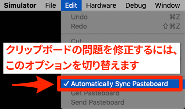
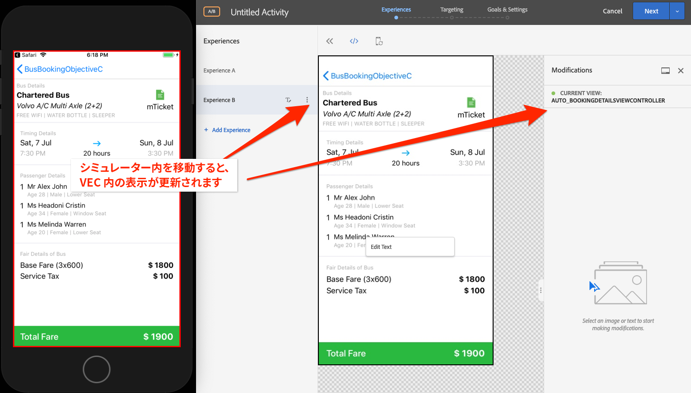

# Adobe Target の Visual Experience Composer（VEC）の追加

このレッスンでは、モバイルアプリケーションに対して Target Visual Experience Composer（VEC） を有効にします。

[Adobe Target](https://docs.adobe.com/content/help/ja-JP/target/using/target-home.html) は、顧客のエクスペリエンスのカスタマイズやパーソナライズに必要なすべてのツールを提供する Adobe Experience Cloud ソリューションです。Web サイト、モバイルサイト、アプリケーション、ソーシャルメディアおよびその他のデジタルチャネルでの収益性を最大化することができます。

ネイティブモバイルアプリ向け Visual Experience Composer（VEC）を使用すると、開発やリリースのサイクルに依存することなく、マーケターが自らアクティビティを作成したりコンテンツをパーソナライズすることができます。

レッスン「[拡張機能の追加](launch-add-extensions.md)」では、Launch プロパティに Target VEC 拡張機能を追加しました。レッスン「[Mobile SDK のインストール](launch-install-the-mobile-sdk.md)」では、サンプルアプリケーションに拡張機能を読み込みました。Target の Mobile Visual Experience Composer でアクティビティの設定を開始するには、若干のマイナーアップデートのみが必要です。

>[!WARNING] モバイルアプリケーションで Target VEC を使用するには、Target と Target VEC の両方の Launch 拡張機能が必要です。

## 学習内容

このレッスンを最後まで学習すると、以下の内容を習得できます。

* Target VEC サンプルアプリケーションの有効化
* Target VEC 要求へのパラメーターの追加
* デバイスと VEC のペアリング
* VEC を使用したアクティビティの作成

## 前提条件

この節のレッスンを完了するには、次が必要です。

* 「[Launch の設定](launch-create-a-property.md)」節のレッスンを完了していること
* Adobe Target インターフェイスへの承認者レベルのアクセス権を持っていること

## パラメーターの追加

ライフサイクル指標は、Target VEC 要求のパラメーターとして自動的に含まれます。また、要求にカスタムパラメーターを追加することもできます。

**カスタムパラメーターを追加するには、以下を実行します。**

1. Xcode で、`BookingViewController.m` ファイルを開きます。このファイルはホーム画面で使用されます。
1. 既存のインポートの下に Target および Target VEC 拡張機能をインポートします。

   ```swift
   #import "ACPTarget.h"
   #import "ACPTargetVEC.h"
   ```

1. `viewDidLoad` 関数内の `super.viewDidLoad` を含む行の後に次のコードを追加します。次のコード例は、パラメーター、プロファイルパラメーター、製品（またはエンティティ）パラメーター、注文パラメーターを TargetVEC 要求に追加する方法を示しています。この例では静的な値を使用しますが、実際のアプリケーションでは動的変数を使用して値を入力すると考えられます。もちろん、このビューに関連するパラメーターのみを設定する必要があります。

   ```objective-c
   NSDictionary *params = @{@"param1":@"value1"};
   NSDictionary *profileParams = @{@"profilekey1":@"profilevalue1"};
   ACPTargetProduct *product = [ACPTargetProduct targetProductWithId:@"1234" categoryId:@"furniture"];
   ACPTargetOrder *order = [ACPTargetOrder targetOrderWithId:@"12343" total:@(123.45) purchasedProductIds:@[@"100",@"200"]];
   ACPTargetParameters *targetParams = [ACPTargetParameters targetParametersWithParameters:params
                                                                         profileParameters:profileParams
                                                                                   product:product
                                                                                     order:order];
   [ACPTargetVEC setGlobalRequestParameters:targetParams];
   ```

   

アプリケーションにパラメーターが追加されたので、次に要求でパラメーターが渡されていることを確認します。

**パラメーターを検証するには、以下を実行します。**

1. Xcode プロジェクトを保存します。
1. アプリケーションをリビルドし、シミュレーターで再度開くまで待ちます。
1. Xcode のコンソールパネルでクリックします。
1. ⌘-F を使用して検索ボックスを開きます。
1. 検索ボックスで `targetvec` を検索します。
1. `Enter` を押して、クリックして、Target 要求と Post 本文にジャンプします。要求に追加したカスタムパラメーターを探します。

   

## モバイルアプリケーションと Target インターフェイスのペアリング

Target インターフェイスで VEC アクティビティを作成するには、まず Target とアプリケーションをペアにする必要があります。このペアリングは、ディープリンクを使用して実現されます。

### ディープリンクスキームの作成

iOS では、[ユニバーサルリンク](https://developer.apple.com/documentation/uikit/core_app/allowing_apps_and_websites_to_link_to_your_content)と[カスタム URL スキーム](https://developer.apple.com/documentation/uikit/core_app/allowing_apps_and_websites_to_link_to_your_content/defining_a_custom_url_scheme_for_your_app)を使用して、アプリケーションへのディープリンクを作成できます。カスタム URL スキームはおそらく、既にアプリケーションで使用されています。その場合は、これらの既存のリンクを使用して Target とペアリングできます。このチュートリアルでは、カスタム URL スキームを作成する必要があります。

**URL スキームを登録するには、以下を実行します。**

1. Xcode で、アプリケーションをダブルクリックして設定画面を開きます。
1. 設定画面で、「`Info`」タブをクリックします。
1. 「`URL Types`」セクションを展開します。
1. **[!UICONTROL 識別子]**&#x200B;は `com.adobetarget.BusBookingObjectiveC` に設定されています。この ID は、必要に応じて使用したり、変更したりできます。
1. **[!UICONTROL URL スキーム]**&#x200B;は `BusBookingObjectiveC` です。このスキームは、必要に応じて使用したり、変更したりできます。
1. **[!UICONTROL エディター]**&#x200B;が&#x200B;**[!UICONTROL 役割]**&#x200B;として選択されていることを確認します。

   

1. 識別子またはスキームを更新した場合は、「`General`」タブをクリックしてスキームを保存します。「`Info`」タブをクリックし、「`URL type`」セクションを展開して、識別子またはスキームが保存されていることを確認します。

次の手順は、ディープリンクにハンドラーを追加することです。

**ディープリンクを処理するには、以下を実行します。**

1. `AppDelegate.m` ファイルを開きます。
1. 下の図のように、「`[ACPCore collectLaunchInfo:@ {@"adb_deeplink": url.absoluteString}];`」セクションに `AppDelegate:application:openURL` 行を追加します。
   

### ディープリンクの確認

これで、アプリケーションをインストールしたユーザーがシミュレーターで `BusBookingObjectiveC://com.adobetarget.BusBookingObjectiveC` のような URL（または定義したスキームなど）を開くと、アプリケーションが開きます。

**ディープリンクスキームを検証するには、以下を実行します。**

1. Xcode プロジェクトを保存します。
1. アプリケーションをリビルドします。
1. シミュレーターで、Safari を開きます。
1. アドレスバーに URL `BusBookingObjectiveC://com.adobetarget.BusBookingObjectiveC`（または定義したスキーム）を入力します。問題がある場合は、以下のヒントの節を参照してください。
1. 「BusBookingObjectiveC でこのページを開く」というモーダルメッセージが表示されます。問題がある場合は、以下のヒントの節を参照してください。
1. `Open` をクリックします。
1. バス予約アプリケーションが開きます。

   > [!TIP] URL をデスクトップからシミュレーターにコピー＆ペーストできない場合、通常、次の 2 つのいずれかが原因です。
   >
   >   1. **Target インターフェイスからコピーした URL をシミュレーターにペーストできません**。これは、デスクトップおよびシミュレーターのクリップボードが同期されていない場合に発生します。この場合は、シミュレーターの `Automatically Sync Pasteboard` 設定をオフに切り替えて、もう一度コピー＆ペーストをおこなってください。
      >
      >      
      
      >
      >   
   1. **URL をペーストすると、Google 検索結果ページに表示されます**。アドレスバーにディープリンク URL をペーストし直して、`Enter` を押します。これを数回繰り返す必要があるかもしれません。


   

これで、ディープリンク構造が設定され、Target VEC を使用してアクティビティを設定する準備が整いました。

## Mobile VEC でのアクティビティの作成

次に、Target UI でアクティビティを作成します。

**Target VEC を使用してアクティビティを作成するには、以下を実行します。**

1. [Adobe Experience Cloud](https://experiencecloud.adobe.com)にログインします。
1. ソリューション切り替えボタンを使用して Target に移動します。

   

1. Target を起動します。

   

1. 「**[!UICONTROL アクティビティを作成]**」ボタンをクリックして、**[!UICONTROL A/B テスト]**&#x200B;を選択します。
1. 「**[!UICONTROL モバイルアプリケーション]**」を選択します。
1. **[!UICONTROL Experience Composer を選択]**&#x200B;で&#x200B;**[!UICONTROL ビジュアル]**&#x200B;が選択されていることを確認します。
1. 「**[!UICONTROL 次へ]**」ボタンをクリックします。

   

1. 「**[!UICONTROL 使用するアプリを選択]**」画面で、「**[!UICONTROL 新しいアプリケーションを追加]**」をクリックします。

   

1. 定義したばかりの URL スキームを「**[!UICONTROL URL スキームを入力]**」フィールドに入力します（例：`BusBookingObjectiveC://com.adobetarget.BusBookingObjectiveC`）。
1. **[!UICONTROL ディープリンクを作成]**&#x200B;をクリックします。

   

   >[!NOTE] アプリケーションにディープリンクを送信する方法はいくつかあります。次のことができます。
   >
   >   1. iOS デバイスから QR コードの写真を撮る（このチュートリアルでは、デバイスを Xcode にリンクする必要があります）。
   >   1. Target インターフェイスからディープリンクをコピーし、デバイスに送信します。
   >   1. 有効な電子メールアドレスにディープリンクを電子メールで送信し、デバイス上の電子メールアプリケーションでリンクを開く。


1. 「**[!UICONTROL リンクをコピーして送信]**」タブをクリックします。
1. リンクの任意の場所をクリックして、リンクをクリップボードに自動的にコピーします。

   

1. シミュレーターに戻ります。
1. シミュレーターで Safari を開きます。
1. ディープリンク URL をアドレスバーにペーストします。
1. `Open`ボタンをクリックしてアプリケーションを開きます。

   > [!TIP] URL をデスクトップからシミュレーターにコピー＆ペーストできない場合、通常、次の 2 つのいずれかが原因です。
   >
   >   1. **Target インターフェイスからコピーした URL をシミュレーターにペーストできません**。これは、デスクトップおよびシミュレーターのクリップボードが同期されていない場合に発生します。この場合は、シミュレーターの `Automatically Sync Pasteboard` 設定をオフに切り替えて、もう一度コピー＆ペーストをおこなってください。
      >
      >      
      
      >
      >   
   1. **URL をペーストすると、Google 検索結果ページに表示されます**。アドレスバーにディープリンク URL をペーストし直して、`Enter` を押します。これを数回繰り返す必要があるかもしれません。


   

1. アプリケーションが読み込まれたら、Target を開いたブラウザータブに戻ります。アプリケーションが VEC に読み込まれていることを確認します。
1. アプリケーション内のテキストおよび画像アセットをクリックすると、編集および置き換えのオプションが表示されます。

   

1. アプリケーションの最初の画面に変更を加えます。
1. 次に、VEC を開いた状態で、ブラウザーの横にシミュレーターを配置します。
1. アプリケーション内の別の画面に移動し、シミュレーターで VEC がどのように更新されたかを確認します。
1. 1 つのアクティビティで、アプリケーション内の複数のビューを更新できます。
   
1. クリックトラッキング指標を視覚的に追加し、Analytics との A4T 統合を使用することもできます。
1. アクティビティを保存して承認し、サンプルアプリケーションでアクティビティが表示されることを確認します。

デバイスと VEC のペアリングは 1 回限りの操作です。同じデバイス上に、今後さらに多くのアクティビティを作成する場合、次の図に示すように、デバイスをリストから選択できます。


>[!TIP] デバイスを開いているが、選択メニューで「使用不可」になっている場合は、ホーム画面に戻ってアプリケーションをバックグラウンドに戻した後でアプリケーションを再びフォアグラウンドに戻すと「使用可能」になります。

## ライフサイクル指標に基づくオーディエンスの作成

ライフサイクル指標は、Adobe Mobile SDK による呼び出しに自動的に含まれる、訪問者のアプリケーションの使用状況に関する組み込み指標です。これらの指標に基づいて、Target で簡単にオーディエンスを構築できます。

**オーディエンスを作成するには、以下を実行します。**

1. Target インターフェイスで、上部のナビゲーションで&#x200B;**オーディエンス**&#x200B;をクリックします。
1. 「**オーディエンスを作成**」ボタンをクリックします。

   

1. オーディエンスに名前を付けます。`Launches < 5`
1. **ルールを追加／ネットワーク**&#x200B;をクリックします。

   

1. 最初のドロップダウンで、**a.Launches**&#x200B;パラメーターを選択します。すべてのライフサイクル指標パラメーターはプレフィックス「a」で始まります。ユーザーが持つアプリケーションの起動数に基づいてコンテンツをターゲット設定します。これは、ユーザーに説明的な初回ユーザーエクスペリエンス（FTUE）を提供し、アプリケーションの初回ユーザーをターゲットにする優れた方法です。
1. 次のドロップダウンで、**次より小さい**&#x200B;を選択します。
1. 3 番目のドロップダウンに、**5** と入力します。
1. **保存**&#x200B;をクリックします。

   

Target には、あらかじめ用意されている様々なオーディエンス作成オプションがあります。また、Target のオーディエンス作成要求でカスタムデータを送信したり、Audience Manager や Analytics など他の Experience Cloud ソリューションから共有されたオーディエンスを使用したり、People コアサービスの顧客属性機能を使用して Target に共有された CRM データを使用したりできます。

[次：「Adobe Target の追加」&gt;](target.md)