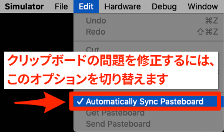
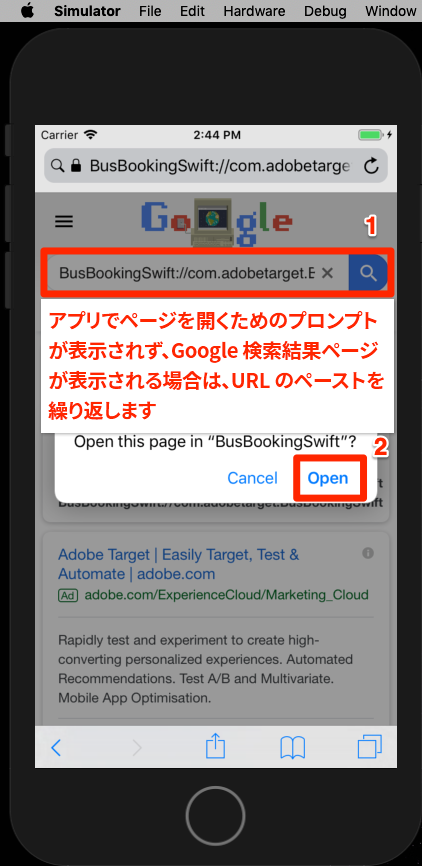

# Adobe targetのVisual Experience Composer(VEC)の追加

このレッスンでは、モバイルアプリに対してTarget Visual Experience Composer(VEC)を有効にします。

[Adobe targetは](https://docs.adobe.com/content/help/en/target/using/target-home.html) 、顧客のエクスペリエンスをカスタマイズしてパーソナライズするために必要なすべての機能を提供するAdobe Experience cloudソリューションです。Webやモバイルサイト、アプリ、ソーシャルメディア、その他のデジタルチャネルの売上を最大化できます。

ネイティブモバイルアプリ向け Visual Experience Composer（VEC）を使用すると、開発やリリースのサイクルに依存することなく、マーケターが自らアクティビティを作成したりコンテンツをパーソナライズすることができます。

「拡張機能の追 [加](launch-add-extensions.md)」のレッスンでは、「起動」プロパティにTarget VEC拡張機能を追加しました。 レッスン「Mobile SDKのイ [ンストール](launch-install-the-mobile-sdk.md) 」では、サンプルアプリケーションに拡張機能を読み込みました。 TargetのMobile Visual Experience Composerでアクティビティの設定を開始するには、若干のマイナーアップデートのみが必要です。

>[!WARNING] モバイルアプリケーションでTarget VECを使用するには、TargetとTarget VEC起動の両方の拡張が必要です。

## 学習目標

このレッスンを最後まで学習すると、以下の内容を習得できます。

* Target VEC用のサンプルアプリを有効にする
* Target VECリクエストへのパラメーターの追加
* デバイスとVECのペアリング
* VECを使用したアクティビティの作成

## 前提条件

この節のレッスンを完了するには、次の作業を行う必要があります。

* 「起動の設定」セクションの [レッスンを完了](launch-create-a-property.md) 。
* Adobe targetインターフェイスへの承認者レベルのアクセス権を持つ

## パラメータの追加

ライフサイクル指標は、Target VECリクエストのパラメーターとして自動的に含まれます。 また、リクエストにカスタムパラメーターを追加することもできます。

**カスタムパラメーターを追加するには**

1. Xcodeで、ファイルを開き `BookingViewController.swift` ます。 このファイルはホーム画面で使用されます。
1. 既存のインポートの下にTargetおよびTarget VEC拡張機能をインポートする

   ```swift
   import ACPTarget
   import ACPTargetVEC
   ```

1. 関数内 `viewDidLoad()` で、を含む行の後に次のコ `super.viewDidLoad()` ードを追加します。 次のコード例は、パラメーター、プロファイルパラメーター、製品（またはエンティティ）パラメーターおよび注文パラメーターをTargetVECリクエストに追加する方法を示しています。 この例では静的な値を使用しますが、実際のアプリでは動的変数を使用して値を設定します。 もちろん、ビューに関連するパラメーターのみを設定する必要があります。

   ```swift
   let params = ["param1":"value1"]
   let profileParams = ["profilekey1":"profilevalue1"]
   let product : ACPTargetProduct = ACPTargetProduct.init(id: "1234", categoryId: "furniture")
   let order : ACPTargetOrder = ACPTargetOrder.init(id: "12345", total: 123.45, purchasedProductIds: ["100", "200"])
   let targetParams : ACPTargetParameters = ACPTargetParameters.init(parameters: params, profileParameters: profileParams, product: product, order: order)
   ACPTargetVEC.setGlobalRequest(targetParams)
   ```

   

アプリにパラメーターが追加されたので、リクエストでパラメーターが渡されていることを確認する時間です。

**パラメータを検証するには**

1. Xcodeプロジェクトの保存
1. アプリを再構築し、シミュレーターで再度開くまで待ちます
1. Xcodeのコンソールパネルでをクリックします。
1. 「検索」ボックスを開くには、ρ-Fを使用します。
1. 「検索」ボッ `targetvec` クスでの検索
1. ヒットを `Enter` クリックして、TargetリクエストとPost本文にジャンプします。 リクエストに追加したカスタムパラメーターを探します。

   

## モバイルアプリとTargetインターフェイスのペアリング

TargetインターフェイスでVECアクティビティを作成するには、まずTargetとアプリをペアにする必要があります。 このペアリングは、ディープリンクを使用して実現されます。

### ディープリンクスキームの作成

iOSでは、ユニバーサルリンクとカ [スタムURLスキ](https://developer.apple.com/documentation/uikit/core_app/allowing_apps_and_websites_to_link_to_your_content) ームを使用して [](https://developer.apple.com/documentation/uikit/core_app/allowing_apps_and_websites_to_link_to_your_content/defining_a_custom_url_scheme_for_your_app) 、アプリへのディープリンクを作成できます。 おそらく、既にアプリでカスタムURLスキームを使用しています。 その場合は、これらの既存のリンクを使用してTargetとのペアを作成できます。 このチュートリアルでは、カスタムURLスキームを作成する必要があります。

**URLスキームを登録するには**

1. Xcodeで、アプリケーションをダブルクリックして設定画面を開きます
1. 設定画面で、「 `Info` 」タブ
1. Expand the `URL Types` section
1. 「 **[!UICONTROL Identifier]** 」は「」に設定されていま `com.adobetarget.BusBookingSwift`す。 このIDは、必要に応じて使用したり、変更したりできます。
1. 「 **[!UICONTROL URLスキーム」は]** 、です `BusBookingSwift`。 このスキームは、必要に応じて使用したり、変更したりできます。
1. 「 **[!UICONTROL Role]** 」が「 **[!UICONTROL Editor」に設定されていることを確認します]**

   

1. 識別子またはスキームを更新した場合は、タブをクリックし `General` てスキームを保存します。  タブをクリックし、セ `Info` クションを展開して、識 `URL type` 別子またはスキームが保存されていることを確認します。

次の手順は、ディープリンクにハンドラーを追加することです。

**ディープリンクを処理するには**

1. Open the `AppDelegate.swift` file
1. 下の図のように、セ `ACPCore.collectLaunchInfo(["adb_deeplink": url.absoluteString])` クションに `AppDelegate:application:openURL` 線を追加します。
   

### ディープリンクの確認

これで、アプリをインストールしたユーザーがシミュレーターで(または定義したスキ `BusBookingSwift://com.adobetarget.BusBookingSwift` ームなど)のようなURLを開くと、アプリケーションが開きます。

**ディープリンクスキームを検証するには**

1. Xcodeプロジェクトの保存
1. アプリを再構築する
1. シミュレーターで、Safariを開きます。
1. アドレスバー `BusBookingSwift://com.adobetarget.BusBookingSwift` にURL（または定義したスキーム）を入力します。 問題がある場合は、以下のヒントの節を参照してください。
1. 「BusBookingSwiftでこのページを開く」というモーダルメッセージが表示されます。 問題がある場合は、以下のヒントの節を参照してください。
1. クリック `Open`
1. バス予約アプリが開きます

   > [!TIP] URLをデスクトップからシミュレーターにコピー&amp;ペーストする際に失敗した場合、通常は次の2つの理由のいずれかが原因です。
   >
   >   1. **TargetインターフェイスからコピーしたURLはシミュレーターに貼り付けられません** 。これは、デスクトップおよびシミュレーターのクリップボードが同期されていない場合に発生します。  この場合は、シミュレーターの設定をオフに切り替えて、 `Automatically Sync Pasteboard` もう一度コピー/貼り付けを行ってください。
      >
      >      
      
      >
      >   
   1. **URLを貼り付けると、Google検索結果ページに表示されます** 。アドレスバーにディープリンクURLを貼り付け直して、ヒットしてみま `Enter`す。 これを数回繰り返す必要があるかもしれません。


   

これで、ディープリンク構造が設定され、Target VECを使用してアクティビティを設定する準備が整いました。

## Mobile VECでのアクティビティの作成

次に、Target UIでアクティビティを作成します。

**Target VECを使用してアクティビティを作成するには**

1. [Adobe Experience cloudへのログイン](https://experiencecloud.adobe.com)
1. ソリューション切り替えボタンを使用してTargetに移動

   

1. Targetの起動

   

1. 「アクティビティ **[!UICONTROL を作成]** 」ボタンをクリックし **[!UICONTROL 、「A/Bテスト」を選択します]**
1. モバイルア **[!UICONTROL プリを選択]**
1. 「Experience Composerを選択」で **[!UICONTROL 「]** Visual **[!UICONTROL 」が選択されていることを確認します。]**
1. 「 **[!UICONTROL Next]** 」ボタン

   

1. 使用するア **[!UICONTROL プリを選択画面で]** 、「新しいアプリを追 **[!UICONTROL 加」をクリックします]**

   

1. 「URLスキームを入力」フィールドに **[!UICONTROL 定義したURLスキーム]** (例： `BusBookingSwift://com.adobetarget.BusBookingSwift`
1. 「ディープリ **[!UICONTROL ンクを作成」をクリックします]**

   

   >[!NOTE] アプリにディープリンクを送信する方法はいくつかあります。 次のことができます。
   >
   >   1. 有効な電子メールアドレスにディープリンクを電子メールで送信し、デバイス上の電子メールアプリケーションでリンクを開きます
   >   1. iOSデバイスからQRコードの写真を撮ります（このチュートリアルでは、デバイスをXcodeにリンクする必要があります）。
   >   1. Targetインターフェイスからディープリンクをコピーし、デバイスに送信します。


1. 「リンクをコピ **[!UICONTROL ーして送信]** 」タブをクリックします。
1. リンクの任意の場所をクリックして、リンクをクリップボードに自動的にコピーします

   

1. シミュレーターに戻る
1. シミュレーターでSafariを開く
1. ディープリンクURLをアドレスバーに貼り付けます。
1. ボタンをクリッ `Open` クしてアプリを開きます

   > [!TIP] URLをデスクトップからシミュレーターにコピー&amp;ペーストする際に失敗した場合、通常は次の2つの理由のいずれかが原因です。
   >
   >   1. **TargetインターフェイスからコピーしたURLはシミュレーターに貼り付けられません** 。これは、デスクトップおよびシミュレーターのクリップボードが同期されていない場合に発生します。  この場合は、シミュレーターの設定をオフに切り替えて、 `Automatically Sync Pasteboard` もう一度コピー/貼り付けを行ってください。
      >
      >      
      
      >
      >   
   1. **URLを貼り付けると、Google検索結果ページに表示されます** 。アドレスバーにディープリンクURLを貼り付け直して、ヒットしてみま `Enter`す。 これを数回繰り返す必要があるかもしれません。


   

1. アプリが読み込まれたら、Targetを開いたブラウザータブに戻ります。 アプリがVECに読み込まれていることを確認します。
1. アプリ内のテキストおよび画像アセットをクリックすると、編集および置き換えのオプションが表示されます。

   

1. アプリの最初の画面に変更を加えます
1. 次に、VECを開いた状態で、ブラウザーの横にシミュレーターを配置します
1. アプリ内の別の画面に移動し、シミュレーターでVECがどのように更新されたかを確認します。
1. 1つのアクティビティで、アプリ内の複数のビューを更新できます。
   
1. クリック追跡指標を視覚的に追加することもできます。
1. アクティビティを保存して承認し、サンプルアプリでアクティビティが表示されることを確認します

デバイスとVECのペアリングは1回限りの操作です。 同じデバイス上に、今後さらに多くのアクティビティを作成する場合、次の図に示すように、デバイスをリストから選択できます。


>[!TIP] デバイスを開いているが、選択メニューが「使用できない」の場合は、ホーム画面に戻ってアプリをバックグラウンドに戻し、アプリを前景に戻して「使用可能」に戻します。

## ライフサイクル指標に基づくオーディエンスの作成

ライフサイクル指標は、Adobe Mobile SDKによる呼び出しに自動的に含まれる、訪問者のアプリの使用状況に関する組み込み指標です。 これらの指標に基づいて、Targetで簡単にオーディエンスを構築できます。

**オーディエンスを作成するには**

1. Targetインターフェイスで、上部のナビゲーショ **ンで** 「オーディエンス」をクリックします
1. Click the **Create Audience** button

   

1. Name the Audience `Launches < 5`
1. Click **Add Rule &gt; Custom**

   

1. 最初のドロップダウンで、 **a.Launchesパラメーターを選択します** 。 すべてのライフサイクル指標パラメーターは「a」で始まります。 プレフィックス ユーザーが持つアプリの起動数に基づいてコンテンツをターゲット設定します。これは、ユーザーに説明的な初回ユーザーエクスペリエンス(FTUE)を提供し、アプリの初回ユーザーをターゲットにする優れた方法です。
1. 次のドロップダウンで、「次より **小さい」を選択します**
1. 3番目のドロップダウンに、 **5と入力します。**
1. Click **Save**

   

Targetには、あらかじめ用意されている様々なオーディエンス作成オプションがあります。 また、Targetのオーディエンス作成リクエストでカスタムデータを送信したり、Audience ManagerやAnalyticsなど他のExperience cloudソリューションから共有されたオーディエンスを使用したり、Peopleコアサービスの顧客属性機能を使用してTargetに共有されたCRMデータを使用したりできます。

[次の「Adobe targetの追加」&gt;](target.md)