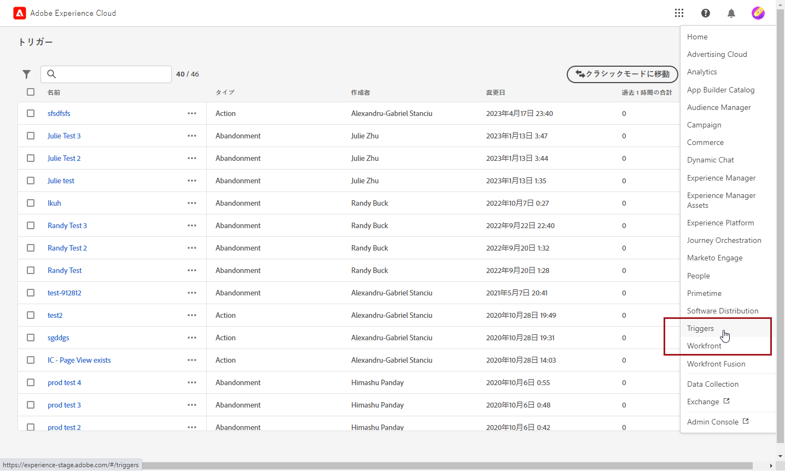
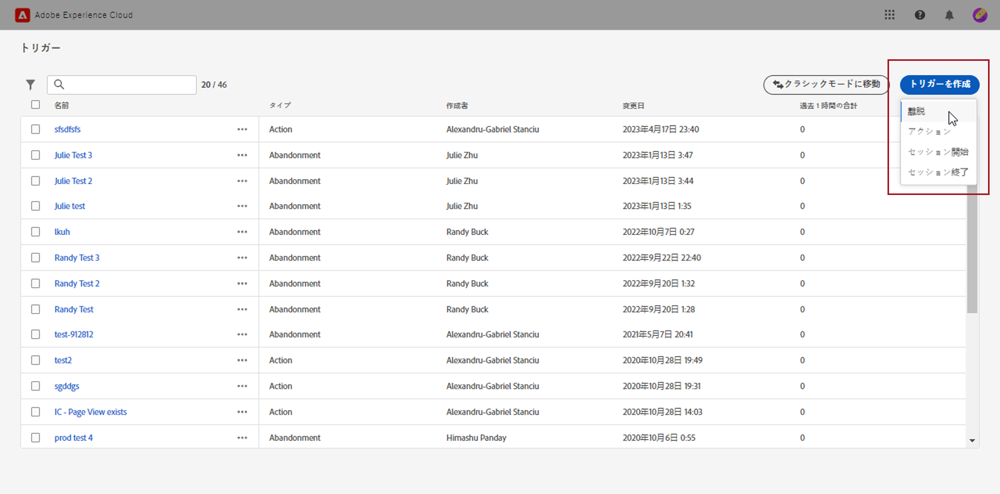
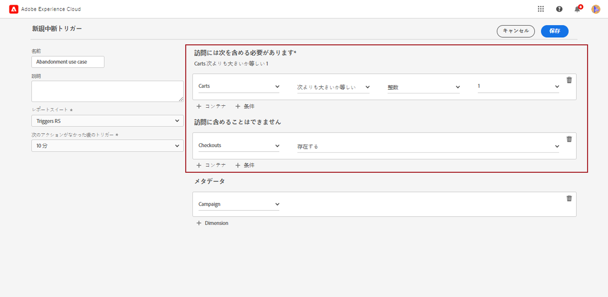
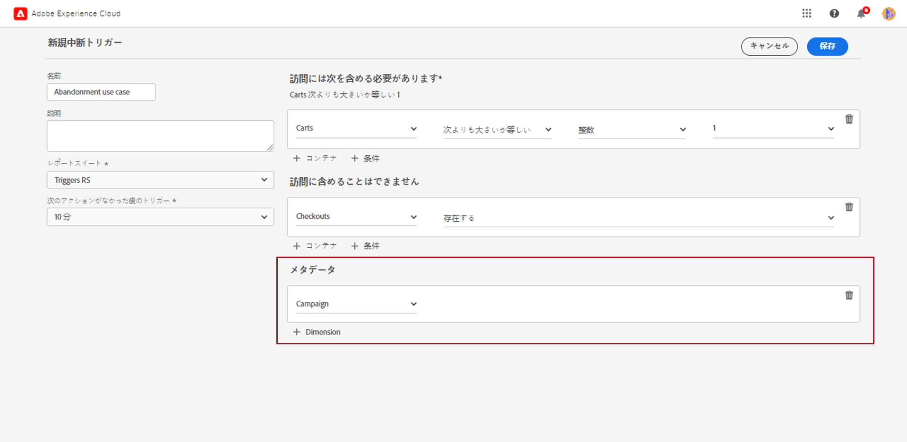
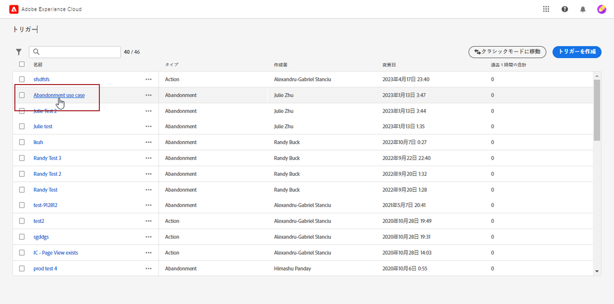
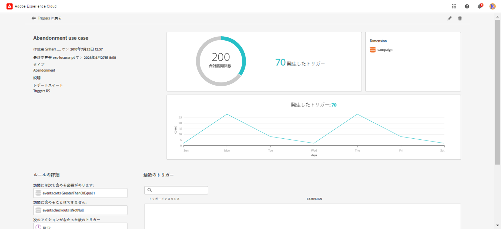

# Experience Cloud トリガーの作成 {#create-triggers}

>[!AVAILABILITY]
>
>Adobe Experience Cloud Triggersの新しいユーザーインターフェイスは、すべての顧客に段階的に展開されます。 詳しくは、Adobe担当者にお問い合わせください。

トリガーを作成し、トリガーの条件を設定します。例えば、買い物かごの放棄のような指標や製品名のようなディメンションなど、訪問中のトリガーのルールに対する条件を指定できます。ルールを満たすと、トリガーが実行されます。

>[!NOTE]
>
> Experience Cloud トリガーの新しいユーザーインターフェイスは、消費者の行動を管理し、ユーザーエクスペリエンスをパーソナライズするための直感的なエクスペリエンスを提供します。以前のインターフェイスに戻すには、「**[!UICONTROL クラシックモードに移動]**」ボタンをクリックします。

1. Experience Cloud で、ソリューション切り替えメニュー、「**[!UICONTROL トリガー]**」の順に選択します。

   

1. トリガーのホームページから「**[!UICONTROL トリガーを作成]**」をクリックし、トリガーの種類を指定します。

   次の 3 種類のトリガーを使用できます。

   * **[!UICONTROL 放棄]**：訪問者が製品を表示したが買い物かごに何も追加しない場合に実行する、トリガーを作成できます。

   * **[!UICONTROL アクション]**：例えば、ニュースレターのサインアップ、メールの購読またはクレジットカードの申請（確認）の後に実行するトリガーを作成できます。小売業者の場合、ロイヤルティプログラムにサインアップする訪問者用のトリガーを作成できます。メディアおよびエンターテインメントでは、特定のショーを観て、調査に回答したいと思われる訪問者用のトリガーを作成できます。

   * **[!UICONTROL セッション開始およびセッション終了]**：セッション開始およびセッション終了イベントのトリガーを作成します。

   

1. トリガーに&#x200B;**[!UICONTROL 名前]**&#x200B;と&#x200B;**[!UICONTROL 説明]**&#x200B;を追加します。

1. このトリガーに使用する Analytics **[!UICONTROL レポートスイート]**&#x200B;を選択します。この設定は、使用するレポートデータを特定します。

   [詳しくは、レポートスイートを参照してください](https://experienceleague.adobe.com/docs/analytics/admin/admin-tools/manage-report-suites/c-new-report-suite/t-create-a-report-suite.html?lang=ja){target="_blank"}。

1. 有効期間の間&#x200B;**[!UICONTROL 何もしない場合のトリガー]**&#x200B;を選択します。

1. **[!UICONTROL 訪問に含める必要がある]**&#x200B;および&#x200B;**[!UICONTROL 訪問に含める必要がない]**&#x200B;カテゴリから、発生の有無の条件や訪問者の行動を定義できます。決定した条件に応じて、条件内または条件間に **And** または **Or** ロジックを指定できます。

   例えば、シンプルな買い物かご放棄トリガーのルールは、次のようになります。

   * **[!UICONTROL 訪問に含める必要がある]**：`Carts (metric) Is greater or equal to 1` を使用して、買い物かごに少なくとも 1 つの品目がある訪問者をターゲットにします。
   * **[!UICONTROL 訪問に含める必要がない]**：`Checkout (metric) Exists.` を使用して、買い物かごの品目を購入した訪問者を削除します。

   

1. 「**[!UICONTROL コンテナ]**」をクリックして、トリガーを定義するルール、条件またはフィルターを確立して保存します。イベントを同時に発生させるには、同じコンテナに配置する必要があります。

   各コンテナはヒットレベルで個別に処理されます。つまり、2 つのコンテナが **[!UICONTROL And]** 演算子で結合されている場合、2 つのヒットが要件を満たしている場合にのみルールが適用されます。

1. 「**[!UICONTROL メタデータ]**」フィールドから、「**[!UICONTROL + ディメンション]**」をクリックして、訪問者の行動に関連する特定のキャンペーンディメンションまたは変数を選択します。

   

1. 「**[!UICONTROL 保存]**」をクリックします。

1. リストから新しく作成した&#x200B;**[!UICONTROL トリガー]**&#x200B;を選択して、トリガーの詳細レポートにアクセスします。

   

1. トリガーの詳細ビューから、発生したトリガーの数に関するレポートにアクセスできます。必要に応じて、鉛筆アイコンでトリガーを編集できます。

   
