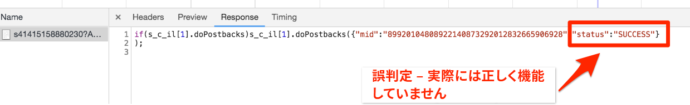

# Adobe Audience Managerの追加

このレッスンでは、サーバー側転送を使用してAdobe Audience Managerを有効にする手順を説明します。

[Adobe Audience Manager](https://docs.adobe.com/content/help/en/audience-manager/user-guide/aam-home.html) (AAM)は、オンラインオーディエンスデータ管理に関する業界トップのサービスを提供し、デジタル広告主や発行者に、販売の成功に役立つデータアセットを制御し活用するためのツールを提供します。

## 学習目標

このレッスンを最後まで学習すると、以下の内容を習得できます。

1. Audience ManagerをWebサイトに導入する2つの主な方法について説明します。
1. Analyticsビーコンのサーバー側転送を使用したAudience Managerの追加
1. Audience Managerの実装を検証します

## 前提条件

このレッスンを完了するには、次の作業が必要です。

1. 「起動の設定」、「Adobe Analyticsの追加 [」、「IDサ](launch.md)ービスの追加 [」のレッスン](analytics.md)を完了するには [、次の手順に従います](id-service.md)。

1. Adobe Analyticsへの管理者アクセス権を持つユーザーは、このチュートリアルで使用するレポートスイートに対して「サーバー側転送」を有効にできます。 または、以下の手順に従って、組織の既存の管理に依頼することもできます。

1. 「Audience Managerサブドメイン」（「パートナー名」「パートナーID」または「パートナーサブドメイン」とも呼ばれます）。 実際のWebサイトにAudience Managerが既に実装されている場合、Audience Managerを入手する最も簡単な方法は、実際のWebサイトに移動してデバッガーを開くことです。 サブドメインは、「概要」タブの「Audience Manager」セクションで使用できます。

   

Audience Managerをまだ実装していない場合は、次の手順に従ってAudience Managerサブドメ [インを取得してください](https://docs.adobe.com/content/help/en/audience-manager-learn/tutorials/web-implementation/how-to-identify-your-partner-id-or-subdomain.html)。

## 導入オプション

WebサイトにAudience Managerを実装するには、2つの方法があります。

* **サーバー側転送(SSF)**- Adobe Analyticsをご利用のお客様にとっては、これを実装する最も簡単で推奨される方法です。 Adobe Analyticsは、アドビのバックエンドでAAMにデータを転送するので、ページ上のリクエストを1つ少なくできます。 また、これにより、主要な統合機能が有効になり、Audience Managerコードの実装およびデプロイメントのベストプラクティスに準拠します。

* **クライアント側DIL**— このアプローチは、Adobe Analyticsをお持ちでないお客様向けです。 DILコード（Data Integration Libraryコード、AAM javaScript設定コード）は、WebページからAudience Managerにデータを直接送信します。

このチュートリアルではAdobe Analyticsを既に展開しているので、サーバー側転送を使用してAudience Managerを展開します。 For a complete description and requirements list for Server-Side forwarding, please review the [documentation](https://docs.adobe.com/content/help/en/analytics/admin/admin-tools/server-side-forwarding/ssf.html), so that you are familiar with how it works, what is required, and how to validate.

## サーバー側転送を有効にする

SSFの実装には、主に次の2つの手順があります。

1. Analytics管理コンソールで「切り替え」をオンにして、レポートスイートごとにAnalyticsからAudience Managerにデータを転 *送します*。
1. コードを配置する（「起動」を使用）。 この機能を正しく動作させるには、Adobe Experience Platform Identity Service拡張とAnalytics拡張をインストールする必要があります(実際には ** 、以下に説明するAAM拡張は必要ありません)。

### Analytics Admin Console でサーバー側転送を有効化する

Adobe AnalyticsからAdobe Audience Managerへのデータの転送を開始するには、Adobe Analytics管理コンソールの設定が必要です。 データの転送を開始するには最大4時間かかる場合があるので、まずこの手順を実行する必要があります。

#### Analytics管理コンソールでSSFを有効にするには

1. Experience Cloud UIを使用してAnalyticsにログインします。 Analyticsへの管理者アクセス権を持っていない場合は、Experience cloudまたはAnalyticsの管理者に問い合わせて、アクセス権を割り当てるか、これらの手順を実行する必要があります。

   

1. Analyticsの上部ナビゲーションで、管理者/レポー **[!UICONTROL トスイートを選択し]**、リストからAudience Managerに転送するレポートスイートを選択（複数選択）します。

   

1. レポートスイート画面で、レポートスイートを選択し、設定の編集/一般/ **[!UICONTROL サーバー側転送を選択します]**。

   

   >[!WARNING] 上記のように、このメニュー項目を表示するには管理者権限が必要です。

1. サーバー側転送ページで、情報を読み、「レポートスイートのサーバー側転送を有効にする **** 」チェックボックスをオンにします。

1. Click **[!UICONTROL Save]**

   

>[!NOTE] SSFはレポートスイートごとに有効にする必要があるので、実際のサイトのレポートスイートにSSFをデプロイする場合は、必ず実際のレポートスイートに対してこの手順を繰り返してください。
>
>また、SSFオプションが灰色表示の場合は、このオプションを有効にするには、レポートスイートをExperience cloud組織にマッピングする必要があります。 これについては、[ドキュメント](https://docs.adobe.com/content/help/en/core-services/interface/about-core-services/report-suite-mapping.html)で説明しています。

この手順が完了し、Adobe Experience Platform IDサービスを有効にしている場合、データはAnalyticsからAAMに転送されます。 ただし、応答がAAMからページ（およびAudience Analytics機能を使用したAnalytics）に正しく返されるようにプロセスを完了するには、「起動」の次の手順も完了する必要があります。 心配するな超簡単だ。

### Launch でサーバー側転送を有効にする

これは、SSFを有効にする2つの手順の2つ目です。 Analytics管理コンソールでスイッチを既に入れ替えているので、コードを追加するだけで済みます。このコードは、右のボックスを選択するだけで起動できます。

>[!NOTE] Analyticsデータのサーバー側転送をAAMに実装する場合、Analytics拡張をAAM拡張ではなく、実際に起動で編集 **** /設定します。 AAM拡張は、Adobe Analyticsを持たないクライアント側DIL実装にのみ使用されます。 したがって、以下の手順は、Analytics拡張機能にユーザーを送信して設定する際に正しく行われます。

#### 起動でSSFを有効にするには

1. 拡張機能/イ **[!UICONTROL ンストール済みに移動し]** 、をクリックしてAnalytics拡張機能を設定します。

   

1. Expand the `Adobe Audience Manager` section

1. 「AnalyticsデータをAudience Managerと自 **[!UICONTROL 動的に共有する」チェックボックスをオンにします]**。 これにより、Audience Managerの「モジュール」（コード）がAnalytics実装に追加され `AppMeasurement.js` ます。

1. 「Audience Managerサブドメイン」（「パートナー名」、「パートナーID」または「パートナーサブドメイン」とも呼ばれる）を追加します。 Audience Managerサブドメインを取 [得するには、次の手順に従います](https://docs.adobe.com/content/help/en/audience-manager-learn/tutorials/web-implementation/how-to-identify-your-partner-id-or-subdomain.html)。

1. 「ライブラ **[!UICONTROL リとビルドに保存」をクリックします]**

   

サーバー側転送コードが実装されました。

### サーバー側転送の検証

サーバー側転送が起動して実行されていることを検証する主な方法は、Adobe Analyticsのヒットに対する応答を調べることです。 すぐにそれに着く。 その一方で、他にもいくつか、望み通りに機能しているか確かめる手助けとなるものを見てみましょう。

#### コードが正しく読み込まれていることの確認

転送を処理するため、特にAAMからページへの応答を処理するためにAdobe Launchがインストールするコードは、Audience Managerの「モジュール」と呼ばれます。 Experience cloudデバッガーを使用して、確実に読み込むことができます。

1. ルミナンスサイトを開く
1. ブラウザーでデバッガーアイコンをクリックして、Experience cloudデバッガーを開きます
1. 「概要」タブを表示したまま、「解析」セクションまで下にスクロールします。
1. Verify that **AudienceManagement** is listed under the Modules section

   

#### デバッガーでのパートナー ID を確認する

次に、デバッガーが正しい「パートナーID」（AKA Partnerサブドメインなど）を取得していることを確認することもできます。を呼び出します。

1. デバッガー内で、「概要」タブを表示したまま、Audience Managerセクションまで下にスクロールします
1. 「パートナー」の下のパートナーID/サブドメインを確認します。

   

>[!WARNING] デバッガーのAudience Managerセクションでは、「データ統合ライブラリ」の「DIL」を参照し、通常はここで実装したサーバー側のアプローチとは異なり、クライアント側の実装を参照していることに注意してください。 実は、AAMの「Module」（このSSFアプローチで使用）は、クライアント側のDILライブラリと同じコードを多く使用しているので、このデバッガは現在、このようにレポートしています。 このチュートリアルの手順に従っていて、この検証セクションの残りの項目が正しい場合は、サーバー側転送が機能していることを確実に確認できます。

#### Analyticsのリクエストと応答の確認

はい、これがビッグ。 AnalyticsからAudience Managerにデータをサーバー側で転送しない場合、Analyticsビーコン（2x2ピクセルを除く）には実際には応答がありません。 ただし、SSFを実行している場合は、Analyticsのリクエストと応答で検証できる項目があり、正しく機能していることを通知します。
残念ながら、現時点では、Experience cloudデバッガーはビーコンへの応答の表示をサポートしていません。 したがって、Charles Proxyやブラウザーの開発者ツールなど、別のデバッガー/パケットスニファーを使用する必要があります。

1. ブラウザーで開発者ツールを開き、「ネットワーク」タブに移動します
1. フィルターフィールドに、表 `b/ss` 示する内容をAdobe Analyticsリクエストに制限する値を入力します
1. ページを更新して、Analyticsリクエストを確認します

   

1. Analyticsビーコン（リクエスト）で、「callback」パラメーターを探します。 次のように設定されます。 `s_c_il[1].doPostbacks`

   

1. Analyticsビーコンに応答します。 リクエストで呼び出されるdoPostbacksへの参照が含まれ、最も重要なのは「stuff」オブジェクトを持つことです。 AAMセグメントIDがブラウザーに返される場所です。 「stuff」オブジェクトを持っている場合、SSFは動作しています。

   

>[!WARNING] 「False」の「Success」に注意 — 応答があり、すべてが機能しているように見える場合は、その「 **stuff** 」オブジェクトがあることを確認します。 そうしないと、応答に「status」:「SUCCESS」というメッセージが表示される場合があります。 これが正しく機能していない証拠で **す** 。 これは、この2番目の手順（「起動」のコード）が完了しているが、Analytics管理コンソールでの転送（この節の最初の手順）がまだ完了していないことを意味します。 この場合は、Analytics管理コンソールでSSFが有効になっていることを確認する必要があります。 もし、まだ4時間も経っていないのなら、我慢しなさい。

[次の「Experience cloud統合」&gt;](integrations.md)