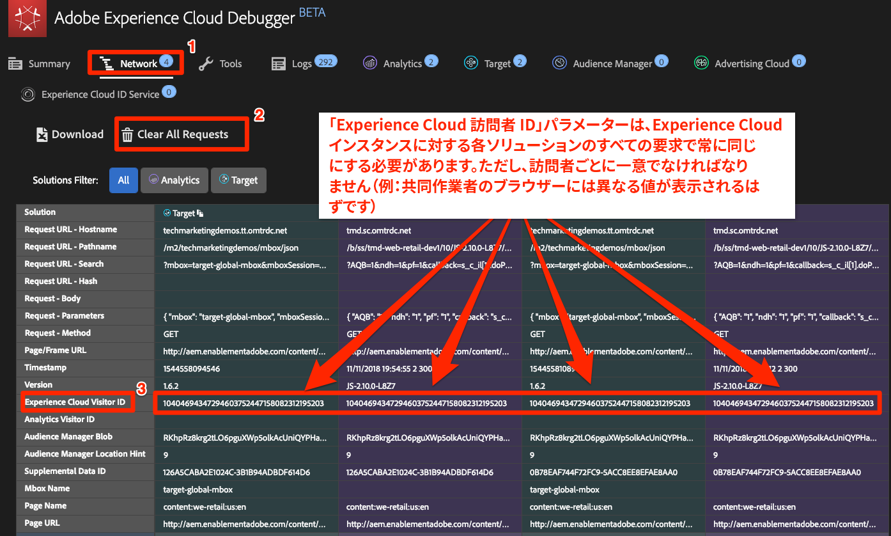
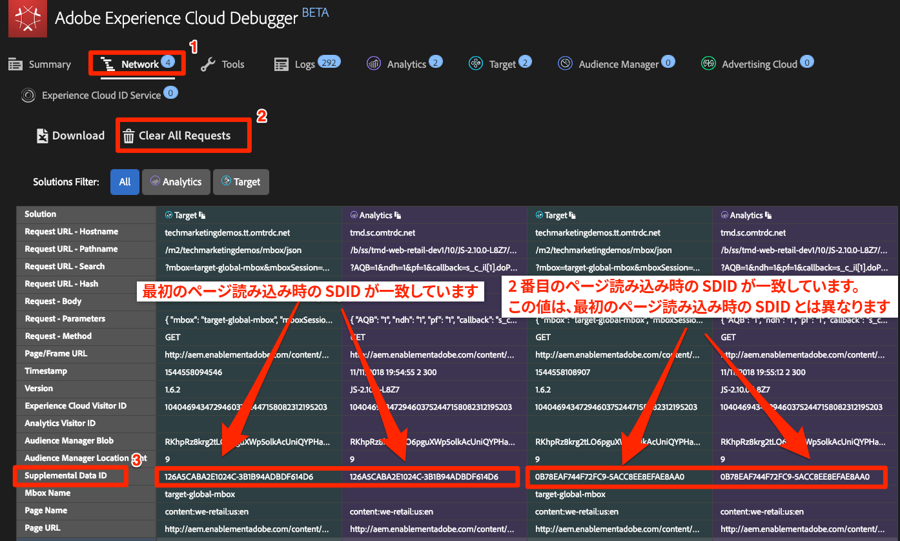
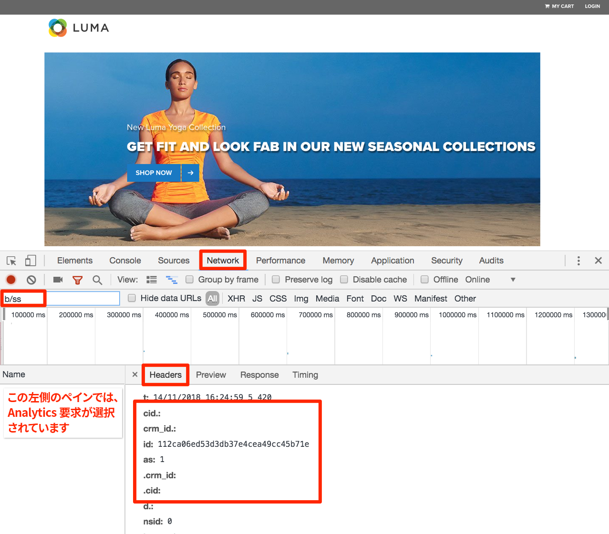

# Experience Cloud の統合

このレッスンでは、実装したソリューション間の主要な統合を確認します。良い知らせは、前のレッスンを完了することで、統合のコード面を既に実装していることです。このレッスンでは、読んだり検証したりする以外の、追加作業は必要ありません。

## 学習内容

このレッスンを最後まで学習すると、以下の内容を習得できます。

1. オーディエンス共有、Analytics for Target（A4T）および顧客属性統合の基本的な使用例を説明する。
1. これらの統合の基本的なクライアント側実装の側面を検証する

## 前提条件

このレッスンの手順に従う前に、このチュートリアルの前のレッスンをすべて完了する必要があります。

>[!NOTE] これらの統合を最大限活用するためには多くのユーザー権限要件、アカウント設定、プロビジョニング手順がありますが、これらはこのチュートリアルの範囲外です。Experience Cloud の現在の実装でこれらの統合をまだ使用していない場合は、以下を検討する必要があります。
>
> * [コアサービス統合](https://docs.adobe.com/content/help/ja-JP/core-services/interface/about-core-services/core-services.html)の完全な要件の確認
> * [Analytics for Target 統合](https://docs.adobe.com/content/help/ja-JP/target/using/integrate/a4t/before-implement.translate.html)の完全な要件の確認
> * Experience Cloud 組織の管理者に、[これらの統合のプロビジョニングをリクエスト](https://www.adobe.com/go/audiences)してもらう

## Audiences

[Audiences](https://docs.adobe.com/content/help/en/core-services/interface/audiences/audience-library.htm) は、People コアサービスの一部で、ソリューション間でオーディエンスを共有するためのものです。例えば、Audience Manager でオーディエンスを作成し、それを使用して Target でパーソナライズされたコンテンツを提供することができます。

A4T の実装に必要な主な要件は、次のとおりです（既に済んでいます）。

1. Adobe Experience Platform ID サービスの実装
1. Audience Manager の実装
1. オーディエンスを受信または作成する他のソリューションの実装（Target や Analytics など）。

### オーディエンス統合の検証

オーディエンス統合を検証する最善の方法は、実際にオーディエンスを作成し、他のソリューションと共有して、それを他のソリューションで完全に使用することです（例えば、AAM セグメントに適格な訪問者が、そのセグメントをターゲットにした Target アクティビティに資格を得られることを確認します）。ただし、これはこのチュートリアルの範囲外です。

これらの検証手順では、クライアントサイドの実装に表示される重要な部分である、訪問者 ID に焦点を当てます。

1. [Luma サイト](https://luma.enablementadobe.com/content/luma/us/en.html)を開きます。

1. [前のレッスン](launch-switch-environments.md)で説明したように、デバッガーが Launch プロパティを&#x200B;*自分の*&#x200B;開発環境にマッピングしていることを確認します。

   

1. デバッガーの「ネットワーク」タブに移動します。

1. **[!UICONTROL すべての要求を消去]**&#x200B;をクリックして、クリーンアップをおこないます。

1. Luma ページをリロードし、デバッガーに Target 要求と Analytics 要求の両方が表示されることを確認します。

1. もう一度.Luma ページをリロードします。

1. これで、デバッガーの「ネットワーク」タブには、4 つの要求（Target が 2 つ、Analytics が 2 つ）が表示されるようになりました。

1. 「Experience Cloud 訪問者 ID」というラベルの付いた行を確認します。各ソリューションのすべての要求の ID は常に同じにする必要があります。

   

1. ID は訪問者ごとに一意であり、これらの手順を繰り返すことによって、共同作業者に確認できます。

## Analytics for Target（A4T）

[Analytics for Target（A4T）](https://docs.adobe.com/content/help/ja-JP/target/using/integrate/a4t/a4t.html)統合を使用すれば、 Analytics データを Target のレポート指標のソースとして活用することができます。

A4T の実装に必要な主な要件は、次のとおりです（既に済んでいます）。

1. Adobe Experience Platform ID サービスの実装
1. Analytics ページビュービーコンの前に Target ページ読み込み要求を実行する

A4T は、Target から Analytics へのサーバーサイド要求と Analytics ページビュービーコンをつなぎ合わせることで機能します。これを「ヒットステッチ」と呼びます。ヒットステッチでは、アクティビティを配信する（または Target ベースの目標指標を増分する）Target 要求に、Analytics ページビュービーコン内のパラメーターと一致するパラメーターがある必要があります。このパラメーターは、補完データ ID（SDID）と呼ばれます。

### A4T の実装の検証

A4T 統合を検証する最善の方法は、A4T を使用して実際に Target アクティビティを構築し、レポートデータを検証することですが、これはこのチュートリアルの範囲外です。このチュートリアルでは、ソリューション呼び出しの間で補完データ ID が一致していることを確認する方法について説明します。

**SDID を検証するには、以下を実行します。**

1. [Luma サイト](https://luma.enablementadobe.com/content/luma/us/en.html)を開きます。

1. [前のレッスン](launch-switch-environments.md)で説明したように、デバッガーが Launch プロパティを&#x200B;*自分の*&#x200B;開発環境にマッピングしていることを確認します。

   

1. デバッガーの「ネットワーク」タブに移動します。

1. **[!UICONTROL すべての要求を消去]**&#x200B;をクリックして、クリーンアップをおこないます。

1. Luma ページをリロードし、デバッガーに Target 要求と Analytics 要求の両方が表示されることを確認します。

1. もう一度.Luma ページをリロードします。

1. これで、デバッガーの「ネットワーク」タブには、4 つの要求（Target が 2 つ、Analytics が 2 つ）が表示されるようになりました。

1. 「Supplemental Data ID」というラベルの付いた行を見つけます。Target と Analytics で、最初のページ読み込みの ID が一致する必要があります。2 番目のページ読み込みからの ID も一致する必要がありますが、最初のページ読み込みの ID とは異なります。

   

A4Tアクティビティの一貫としてページ読み込みの範囲（単一ページアプリを含まない）で追加の Target 要求をおこなう場合、それらが引き続き保持されるように、一意の名前（target-global-mboxではない）を付けることをお勧めします。こうすると、最初の Target 要求および Analytics 要求と同じ SDID が維持されます。

## 顧客属性

[顧客属性](https://docs.adobe.com/content/help/ja-JP/core-services/interface/customer-attributes/attributes.html)は、顧客関係管理（CRM）データベースからデータをアップロードして Analytics および Adobe Target でそれらを活用できる People コアサービスの一部です。

顧客属性を実装する主な要件は、次のとおりです（既におこなった要件）。

1. Adobe Experience Platform ID サービスの実装
1. Target および Analytics が要求をおこなう&#x200B;*前に*、ID サービス経由で顧客 ID を設定する（Launch のルール順序機能を使用して達成済み）。

### 顧客属性の実装の検証

以前のレッスンで、顧客 ID が ID サービスと Target の両方に渡されることを既に検証済みです。また、Analytics ヒットでも顧客 ID を検証します。現時点では、顧客 ID は Experience Cloud デバッガーに表示されないパラメーターのうちの 1 つですが、ブラウザーの JavaScript コンソールを使用して表示することができます。

1. Luma サイトを開きます。
1. ブラウザーの開発者ツールを開きます。
1. 「ネットワーク」タブに移動します。
1. フィルターフィールドに `b/ss` と入力して、表示する内容を Adobe Analytics 要求に制限します。

   

1. サイトの右上隅にある&#x200B;**[!UICONTROL ログイン]**&#x200B;リンクをクリックします。

   

1. ユーザー名として `test@adobe.com` を入力します。
1. パスワードとして `test` を入力します。
1. 「**[!UICONTROL ログイン]**」ボタンをクリックします。

   

1. ホームページに戻り、開発者ツールに表示されるビーコンもトリガーされます。アカウント情報ページに移動した場合は、WE.RETAIL ロゴをクリックしてホームページに戻ります。
1. 要求をクリックし、「ヘッダー」タブを選択します。
1. 下にスクロールして、ネストされたパラメーターが表示されるようにします。
   1. cid — 要求の顧客 ID 部分の標準区切り文字
   1. crm_id — ID サービスのレッスンで指定したカスタム統合コード
   1. id — `Email (Hashed)`データ要素から取得される顧客 ID 値
   1. as - 認証状態（「1」は「ログイン済み」）
   

[次：「プロパティのパブリッシュ」&gt;](publish.md)