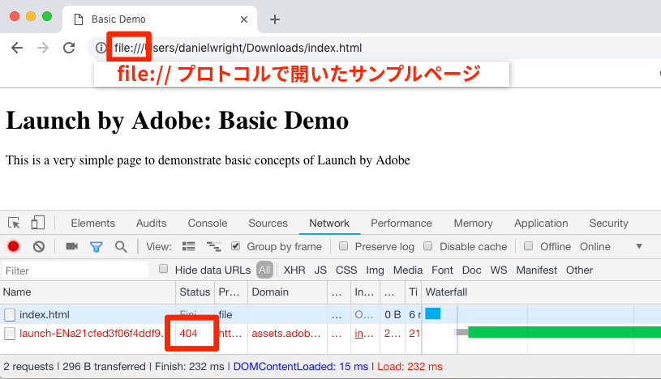

# Launch 埋め込みコードの追加

このレッスンでは、Launch プロパティの開発環境の非同期埋め込みコードを実装します。途中で、Launch の 2 つの主要な概念である環境と埋め込みコードについて学びます。

## 学習内容

このレッスンを最後まで学習すると、以下の内容を習得できます。

* プロパティの埋め込みコードを取得する。
* 開発環境、ステージング環境および実稼動環境の違いについて理解する。
* HTML ドキュメントに埋め込みコードを追加する。
* 埋め込みコードに最適な場所を、HTML ドキュメントの `<head>` 内にある別のコードと比較して説明する。

## 埋め込みコードをコピーする。

埋め込みコードは、サイトのページに配置し、Launch で作成したロジックを読み込んで実行する `<script>` タグです。ライブラリを非同期で読み込むと、ブラウザーはページの読み込みを続行して Launch ライブラリを取得し、並行して実行します。この場合、`<head>` に配置する埋め込みコードは 1 つだけです。（Launch が同期的にデプロイされた場合は 2 つの埋め込みコードがあります。1 つは `<head>`、もう 1 つは `</body>` の前に配置します）。

プロパティの概要画面から、「`Environments`」タブをクリックして環境ページに移動します。開発環境、ステージング環境、および実稼動環境は、事前に作成されています。


開発環境、ステージング環境、および実稼動環境は、コード開発やリリースプロセスの一般的な環境に対応しています。コードは、開発環境の開発者が最初に記述します。作業が完了したら、QA および他のチームがレビューできるよう、ステージング環境に送信します。QA チームやその他のチームが満足したら、コードは実稼動環境に公開されます。この環境は、訪問者が Web サイトにアクセスしたときに表示される、公開環境です。

Launch では、追加の開発環境を許可します。これは、複数の開発者が同時に異なるプロジェクトで作業する大規模な組織で便利です。

チュートリアルの完了に必要なのは、これらの環境のみです。環境を使用することで、様々な URL でホストされる Launch ライブラリの様々な作業バージョンを用意し、新しい機能を安全に追加して、適切なタイミングで適切なユーザー（開発者、QA エンジニア、一般ユーザーなど）にリリースすることができます。

次に、埋め込みコードをコピーします。

1. **[!UICONTROL 開発]**&#x200B;行で、インストールアイコン をクリックして、モーダルを開きます。

1. Launch は、デフォルトで非同期埋め込みコードに設定されます。

1. コピーアイコンをクリックして、埋め込みコードをクリップボードにコピーします。

1. **[!UICONTROL 閉じる]**&#x200B;をクリックしてモーダルを閉じます。

   

## サンプル HTML ページの `<head>` に埋め込みコードを実装します。

埋め込みコードは、プロパティを共有するすべての HTML ページの `<head>` 要素に実装する必要があります。サイトをまたいでグローバルに `<head>` を制御するテンプレートファイルを 1 つ以上使用することで、Launch への追加プロセスを簡単にすることができます。

まだの場合、[サンプルの HTML ページ](https://www.enablementadobe.com/multi/web/basic-sample.html)をダウンロードして（このリンクを右クリックし、「リンクに名前を付けて保存」をクリック）、コードエディターで開きます。エディターが必要な場合、[Brackets](http://brackets.io/)は、オープンソースの無料エディターです。

34 行目またはその周辺にある既存の埋め込みコードを、クリップボードのコードと置き換えてページを保存します。次に、Web ブラウザーでページを開きます。`file://` プロトコルを使用してページを読み込む場合は、コードエディターで、埋め込みコード URL の先頭に「https:」を付ける必要があります）。サンプルページの 33～36 行は次のようになります。

```html
    <!--Launch Header Embed Code: REPLACE LINE 39 WITH THE EMBED CODE FROM YOUR OWN DEVELOPMENT ENVIRONMENT-->
    <script src="https://assets.adobedtm.com/launch-ENa21cfed3f06f4ddf9690de8077b39e81-development.min.js" async></script>
    <!--/Launch Header Embed Code-->
```

Web ブラウザーの開発者ツールを開き、「ネットワーク」タブに移動します。この時点で、Launch 環境 URL に 404 エラーが表示されます。

404 エラーが発生するのは、この Launch ライブラリにはまだライブラリを作成していないためです。これについては、次のレッスンでおこないます。404 エラーではなく「Failed」メッセージが表示された場合は、埋め込みコードに `https://` プロトコルを追加し忘れている可能性があります。`file://` プロトコルを使用してサンプルページを読み込む場合にのみ、`https://` プロトコルを指定する必要があります。変更を加え、404 エラーが表示されるまでページをリロードします。

## Launch 実装のベストプラクティス

サンプルページで実証されている Launch 実装のベストプラクティスのいくつかを見てみましょう。

* **データレイヤー**：

   * サイト上でデジタルデータレイヤーを作成し、Analytics、Target、およびその他のマーケティングソリューションで変数を生成するため必要なすべての属性を含めることを&#x200B;*強く*&#x200B;推奨します。このサンプルページには非常にシンプルなデータレイヤーのみが含まれていますが、実際のデータレイヤーにはページ、訪問者、買い物かごの詳細などの詳細情報が多数含まれる可能性があります。データレイヤーについて詳しくは、[Customer Experience Digital Data Layer 1.0](https://www.w3.org/2013/12/ceddl-201312.pdf) を参照してください。

   * Target、顧客属性および Analytics で可能な操作を最大限にするために、Launch 埋め込みコードの前にデータレイヤーを定義します。

* **JavaScript ヘルパーライブラリ**：JQuery などのライブラリを既にページの `<head>` に実装している場合は、Launch および Target で構文を活用するため、 の前に読み込みます。

* **HTML5 doctype**：HTML5 doctype は Target の実装に必要です。

* **preconnect および dns-prefetch**：ページの読み込み時間を改善するには preconnect および dns-prefetch を使用します。参照：[/](https://w3c.github.io/resource-hints/)https://w3c.github.io/resource-hints/

* **非同期 Target 実装の前の事前非表示スニペット**：この点については、Target のレッスンで詳しく説明しますが、非同期的な Launch 埋め込みコードを使用して Target を導入する場合は、コンテンツのちらつきを管理するために、Launch 埋め込みコードの前に事前に非表示のスニペットをページにハードコードする必要があります。

これらのベストプラクティスについて、推奨順にまとめました。アカウント固有の詳細を示すプレースホルダーがいくつかあります。

```html
<!doctype html>
<html lang="en">
<head>
    <title>Basic Demo</title>
    <!--Preconnect and DNS-Prefetch to improve page load time. REPLACE "techmarketingdemos" WITH YOUR OWN AAM PARTNER ID, TARGET CLIENT CODE, AND ANALYTICS TRACKING SERVER-->
    <link rel="preconnect" href="//dpm.demdex.net">
    <link rel="preconnect" href="//fast.techmarketingdemos.demdex.net">
    <link rel="preconnect" href="//techmarketingdemos.demdex.net">
    <link rel="preconnect" href="//cm.everesttech.net">
    <link rel="preconnect" href="//techmarketingdemos.tt.omtrdc.net">
    <link rel="preconnect" href="//techmarketingdemos.sc.omtrdc.net">
    <link rel="dns-prefetch" href="//dpm.demdex.net">
    <link rel="dns-prefetch" href="//fast.techmarketingdemos.demdex.net">
    <link rel="dns-prefetch" href="//techmarketingdemos.demdex.net">
    <link rel="dns-prefetch" href="//cm.everesttech.net">
    <link rel="dns-prefetch" href="//techmarketingdemos.tt.omtrdc.net">
    <link rel="dns-prefetch" href="//techmarketingdemos.sc.omtrdc.net">
    <!--/Preconnect and DNS-Prefetch-->
    <!--Data Layer to enable rich data collection and targeting-->
    <script>
    var digitalData = {
        "page": {
            "pageInfo" : {
                "pageName": "Home"
                }
            }
    };
    </script>
    <!--/Data Layer-->
    <!--jQuery or other helper libraries-->
    <script src="https://code.jquery.com/jquery-3.3.1.min.js"></script>
    <!--/jQuery-->
    <!--prehiding snippet for Adobe Target with asynchronous Launch deployment-->
    <script>
        (function(g,b,d,f){(function(a,c,d){if(a){var e=b.createElement("style");e.id=c;e.innerHTML=d;a.appendChild(e)}})(b.getElementsByTagName("head")[0],"at-body-style",d);setTimeout(function(){var a=b.getElementsByTagName("head")[0];if(a){var c=b.getElementById("at-body-style");c&&a.removeChild(c)}},f)})(window,document,"body {opacity: 0 !important}",3E3);
    </script>
    <!--/prehiding snippet for Adobe Target with asynchronous Launch deployment-->
    <!--Launch Header Embed Code: REPLACE LINE 39 WITH THE INSTALL CODE FROM YOUR OWN DEVELOPMENT ENVIRONMENT-->
    <script src="//assets.adobedtm.com/launch-EN93497c30fdf0424eb678d5f4ffac66dc.min.js" async></script>
    <!--/Launch Header Embed Code-->
</head>
<body>
    <h1>Launch by Adobe: Basic Demo</h1>
    <p>This is a very simple page to demonstrate basic concepts of Launch by Adobe</p>
</body>
</html>
```

これで、サイトに Launch 埋め込みコードを追加する方法が分かりました。

[次：「データ要素ルールおよびライブラリの追加」&gt;](launch-data-elements-rules.md)