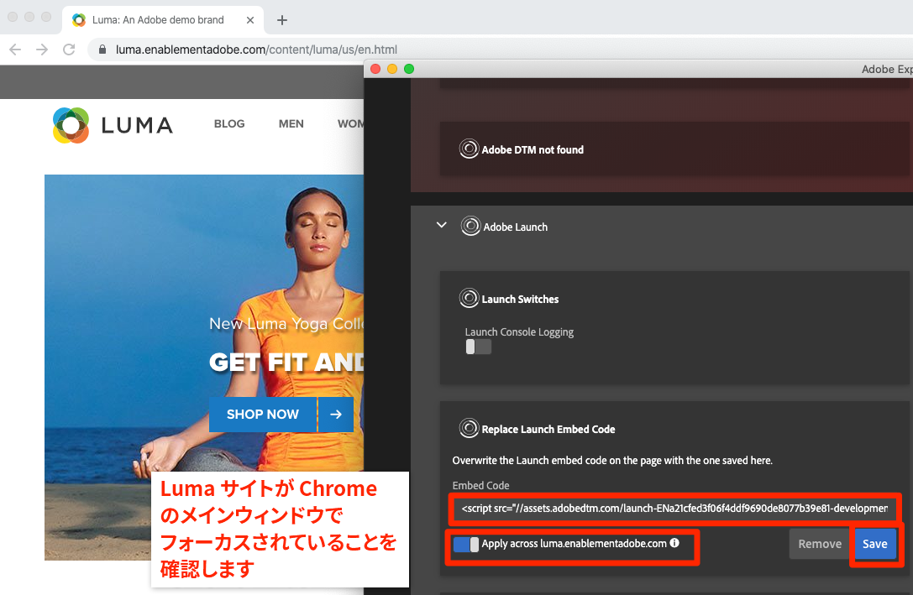

# Experience Cloud デバッガーでの Launch 環境の切り替え

このレッスンでは、[Adobe Experience Cloud デバッガー拡張機能](https://chrome.google.com/webstore/detail/adobe-experience-cloud-de/ocdmogmohccmeicdhlhhgepeaijenapj)を使用して、[Luma デモサイト](https://luma.enablementadobe.com/content/luma/us/en.html)でハードコード化された Launch プロパティを、独自のプロパティと置き換える方法について説明します。

この手法は環境の切り替えと呼ばれ、後で自分の Web サイトで Launch を使用する場合に役立ちます。Launch の&#x200B;*開発*&#x200B;環境で実稼動環境の Web サイトをブラウザーに読み込むことができます。これにより、通常のコードリリースとは独立し、自信を持って Launch に変更を加えて検証できます。結局、マーケティングタグリリースを通常のコードリリースから分離できるということが、顧客が Launch を最初に使用する主な理由の 1 つです。

## 学習内容

このレッスンを最後まで学習すると、以下の内容を習得できます。

* デバッガーを使用して、代替 Launch 環境を読み込む。
* デバッガーを使用して、代替 Launch 環境を読み込んだことを検証する。

## 開発環境 URL の取得

1. Launch プロパティで、`Environments` ページを開きます。

1. **[!UICONTROL 開発]**&#x200B;行で、インストールアイコンをクリックして、モーダルを開きます。

1. コピーアイコンをクリックして埋め込みコードをクリップボードにコピーします。

1. **[!UICONTROL 閉じる]**&#x200B;をクリックしてモーダルを閉じます。

   

## Luma でもサイトの Launch URL を置き換えます。

1. Chrome ブラウザーで [Luma デモサイト](https://luma.enablementadobe.com/content/luma/us/en.html)を開きます。

1.  アイコンをクリックして、[Experience Cloud デバッガー拡張機能](https://chrome.google.com/webstore/detail/adobe-experience-cloud-de/ocdmogmohccmeicdhlhhgepeaijenapj)を開きます。

   

1. 現在実装されている Launch プロパティは、「概要」タブに表示されます。

   

1. 「ツール」タブに移動します。

1. **[!UICONTROL Launch 埋め込みコードを置換]**&#x200B;セクションまでスクロールします。

1. Luma サイトの「Chrome」タブがデバッガーの背後にあることを確認します（このチュートリアルのタブや Launch インターフェイスのタブではなく）。クリップボードにある埋め込みコードを入力フィールドに貼り付けます。

1. 「luma.enablementadobe.com 全体で適用」機能をオンにして、Luma サイトのすべてのページが Launch プロパティにマッピングされるようにします。

1. 「**[!UICONTROL 保存]**」ボタンをクリックします。

   

1. Luma サイトを再読み込みし、デバッガーの「概要」タブを確認します。Launch セクションには、使用中の開発プロパティが表示されます。プロパティ名がユーザーと一致し、環境が「開発」となっていることを確認します。

   

>[!NOTE] デバッガーはこの設定を保存し、Luma サイトに戻るたびに Launch 埋め込みコードを置き換えます。他の開いているタブでアクセスする他のサイトには影響しません。デバッガーによる埋め込みコードの置き換えを停止するには、デバッガーの「ツール」タブの埋め込みコードの横にある&#x200B;**[!UICONTROL 削除]**&#x200B;をクリックします。

チュートリアルを続ける際には、この方法を使用して、Luma サイトを独自の Launch プロパティにマッピングし、Launch 実装を検証します。実稼動用 Web サイトで Launch の使用を開始する場合、同じ方法を使用して変更を検証できます。

[次：「Adobe Experience Platform ID サービスの追加」&gt;](id-service.md)